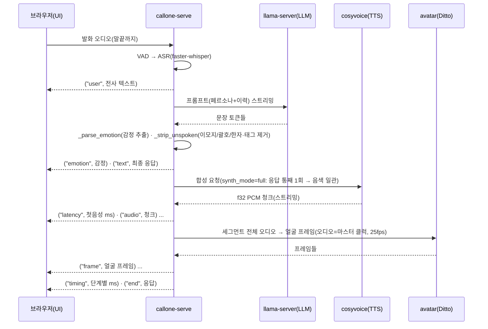

# callone — call + clone

사진 1장과 짧은 목소리만으로 **그 사람과 영상통화하듯** 대화하는 로컬 시스템.
음성 복제(TTS) + 한국어 대화(LLM 페르소나) + 말하는 얼굴(토킹헤드)을 **전부 로컬 오픈소스**로 돌린다(유료 API 0원).

> ⚠️ **윤리:** 결과물은 그 사람의 **근사(近似)** 다. 사칭·기만 금지, 사적/추모/연구 목적 한정.
> 통화 녹음·개인정보 관련 관할 법규를 준수하라. 본인이 권리를 가진 음성·사진만 사용할 것.

---

## 처음이라면 → **[docs/FRESH_SETUP.md](docs/FRESH_SETUP.md)**

현재 확정 스택과 남은 GPU 검증은 **[docs/CURRENT_STATUS.md](docs/CURRENT_STATUS.md)**.
새 GPU 인스턴스에서 클론 → 스크립트 3개 → 실행까지 **한 번에** 세팅하는 절차. 이 문서 하나면 된다.

---

## 두 가지 사용 방식 (목적에 맞게 선택)

| | **A. 제로샷 (빠른 복제)** ← 기본·권장 | **B. 풀 파인튜닝 (고충실도)** ← 고급 |
|---|---|---|
| 입력 | **5~10초** 깨끗한 음성 1개 + 사진 1장 | **1시간 이상** 통화/녹음 + 화자 분리 |
| 학습 | **없음**(업로드 즉시 사용) | 화자별 TTS·페르소나 **파인튜닝**(수 시간) |
| 음성 | CosyVoice3 제로샷 클론 | Piper 화자학습(onnx, 최고 충실도) |
| 대화 | EXAONE + 페르소나 프롬프트 | + 화자 실제 발화 학습/RAG |
| 쓰는 곳 | UI에서 파일 업로드 → 바로 통화 | `docs/` 학습 파이프라인(아래) |
| 문서 | **[FRESH_SETUP.md](docs/FRESH_SETUP.md)** | [학습 파이프라인](#풀-파인튜닝-파이프라인-고급) |

대부분은 **A(제로샷)** 이면 충분하다. 음색을 더 끌어올리고 싶고 긴 녹음이 있으면 B.

---

## 두 가지 GPU 타깃 (둘 다 지원)

| | **A100 / H100** (예: Elice) | **RTX 4090 / 3090** (예: RunPod) |
|---|---|---|
| 아키텍처 | Ampere/Hopper | Ada/Ampere |
| LLM | **EXAONE-4.0-32B-abliterated Q6_K** | EXAONE-3.5-7.8B-abliterated Q6_K(VRAM 한계) |
| TTS·ASR | CosyVoice3·whisper | 동일 |
| 토킹헤드(Ditto) | **프리빌트 TensorRT 엔진**(`ditto_trt_Ampere_Plus`) 그대로 사용 | **Ada는 엔진 재빌드 필요**(onnx→trt) 또는 PyTorch 폴백 |
| VRAM | 여유(80GB) | 24GB — 7.8B LLM + 0.5B TTS + Ditto 들어감 |

세팅 스크립트는 GPU를 감지해 자동 처리한다. 4090 관련 주의는 [FRESH_SETUP.md](docs/FRESH_SETUP.md) "알아둘 것" 참고.

---

## 구성 (4개 독립 서비스 = 각자 venv/프로세스)

| 서비스 | 포트 | 역할 | 모델 |
|---|---|---|---|
| `llama-server` | 8090 | 한국어 대화 LLM | EXAONE-4.0-32B(A100/H100) / 3.5-7.8B(24GB GPU) |
| `cosyvoice-server` | 8092 | 제로샷 음색 복제 TTS | CosyVoice3-0.5B (conda env) |
| `avatar-server` | 8091 | 사진→말하는 얼굴 | Ditto (TensorRT, `.venv-avatar`) |
| `callone-serve` | 8000 | 오케스트레이터(ASR+LLM+TTS+아바타 조립, WS) | faster-whisper large-v3-turbo (`.venv-serve`) |

무거운 스택끼리 의존성 충돌을 피하려 **별 프로세스 + HTTP/WS**로만 연결(llama-server 패턴). UI는 `ui/`(React).

우선순위: **① 목소리 유사도 → ② 한국어 자연스러움 → ③ 얼굴 매칭 → ④ 속도.**

---

## 워크플로우 (전체 진행 과정)

### 0. 큰 그림 — 4개 서비스 데이터 흐름

```
┌─────────────┐   WebSocket(:8000)    ┌──────────────────────────────────────────┐
│  브라우저 UI │◄─────────────────────►│           callone-serve (오케스트레이터)   │
│  (React)    │   오디오/이벤트/프레임  │           .venv-serve · faster-whisper      │
└─────────────┘                        │                                            │
   ▲  마이크 PCM                        │  VAD → ASR → LLM → TTS → (아바타) → 스피커  │
   │  스피커 PCM + 얼굴 프레임           └───┬───────────┬───────────────┬──────────┘
   │                                        │HTTP       │HTTP           │HTTP
   │                              ┌─────────▼──┐  ┌─────▼───────┐  ┌────▼────────┐
   │                              │llama-server│  │cosyvoice-srv│  │avatar-server│
   └── 개인데이터는 브라우저 소유   │  :8090     │  │  :8092      │  │  :8091      │
       (서버는 인메모리, 종료 즉시  │ EXAONE LLM │  │ CosyVoice3  │  │ Ditto(TRT)  │
        폐기 — 디스크/로그 0)      └────────────┘  └─────────────┘  └─────────────┘
```

- 무거운 스택(torch/conda/TensorRT)끼리 의존성 충돌을 피하려 **각자 별 프로세스**로 띄우고 HTTP/WS로만 붙인다.
- `callone-serve`(`.venv-serve`)에는 torch/cosyvoice가 **없다** — 전부 원격 호출.

### 1. 부팅 (서비스 기동 + 워밍업)

```
run_all.sh → llama-server(:8090) · cosyvoice-server(:8092) · avatar-server(:8091) · callone-serve(:8000)
                                         │
        각 서비스 health 통과 후 ────────►  Orchestrator 생성 시 warmup=true 면 더미 1회 예열:
                                            ASR(무음 전사) + LLM(짧은 프롬프트) + TTS(짧은 합성)
                                            → CUDA graph 빌드 · llama 슬롯 · ref 인코딩 캐시 예열
                                            → 첫 통화 턴의 콜드스타트(수 초)를 부팅 시간으로 이동
```

`callone/serve/orchestrator.py`의 `Orchestrator.__init__` → `warmup()`. 목소리/출력엔 영향 0(더미 폐기).

### 2. 통화 시작 — `session_init` (전부 인메모리)

브라우저가 통화를 열 때 WS로 `session_init` 메시지를 보낸다. `callone/serve/app.py`의 `_parse_session_init` → `Orchestrator.init_session()`이 **별 스레드(executor)** 에서 세션을 구성한다("연결 중" 동안 처리, 이벤트 루프 안 막음).

| 프론트가 보내는 것 | 하는 일 |
|---|---|
| `ref_audio_b64` (5~10초 음성) | 목소리 복제 레퍼런스 → `set_reference`(인메모리 b64, `/dev/shm`) |
| `nsfw: true` (선택) | 섹시/ASMR 모드 → `tts.nsfw_ref_path` 프리셋 레퍼런스로 **교체**(설정 시. 프론트 음성 무시, 미설정이면 폴백) |
| `portrait_b64` (사진 1장) | 얼굴 → avatar-server 세션 시작 + 첫 프레임 콜드(~30s) 예열 |
| `persona`/`situation`/캐릭터 카드 | 상황극 페르소나 → LLM `set_context` |
| `history` (이전 대화) | 대화 이력 복원(클라가 보관·복원, 서버엔 안 남김) |

레퍼런스가 잡히면 세션 ref로 TTS CUDA graph를 미리 캡처(~10s) → 첫 턴 콜드 제거.

### 3. 한 턴의 진행 — `stream_turn()` 이벤트 스트림

사용자가 말을 끝내면(VAD가 말끝 감지) 그 발화 오디오로 `Orchestrator.stream_turn(audio)`가 돌며, WS로 이벤트를 **나오는 대로** 흘린다(첫 음성 빠르게):



핵심 동작:
- **문장 스트리밍**: LLM 응답을 모으되, 합성은 `synth_mode`로 제어 — `full`(통째 1회, 운율·음색 일관, 기본) / `sentence`(문장별, 첫음성 최저지연).
- **입으로 못 읽는 것 제거**: `_strip_unspoken`이 이모지·괄호 해설(`(웃으며)`)·한자·대괄호 태그를 발화 직전 정제(TTS 오발음 차단).
- **barge-in**: 클론이 말하는 중 사용자가 말하면 `interrupt()` → 진행 중 LLM/TTS/아바타 스트림을 즉시 중단하고 `("interrupted", None)`.
- **아바타는 선택 레이어**: 없거나 실패해도 음성은 그대로 진행(정지 사진/음성전용 폴백).

### 4. 지연 구조 (어디서 시간 먹나)

`("timing", …)` 이벤트로 매 턴 단계별 ms를 측정한다(목소리 영향 0, 병목 진단용):

```
첫 음성 지연 = ASR ─→ LLM 첫 문장 ─→ TTS 첫 청크
               (전사)   (llama 생성)   (cosyvoice 합성, 최대 단일 병목)
```

- TTS 첫 청크가 보통 최대 병목 → `stream`(네이티브 bistream) + `chunk_size`(작을수록 첫음성↓, 음색 거의 불변)로 조절. 라이브 끊김은 저장 wav A/B로 안 보이니 실통화로 확인 후 내린다.

### 5. 통화 종료 — `cleanup_session`

인메모리 개인데이터를 **즉시 폐기**: TTS 레퍼런스(`/dev/shm` 삭제) · 대화 이력 · 아바타 세션 해제. 디스크 파일·로그 본문 흔적 0. 대화 이력은 브라우저가 내보내기로 보관.

### 6. 섹시/ASMR(nsfw) 모드 — 레퍼런스만 교체

CosyVoice3 **제로샷 메커니즘을 그대로** 쓰되(Piper/RVC로 교체 안 함), breathy/속삭임 프리셋 클립을 레퍼런스로 준다:

```
configs/serve.yaml:  tts.nsfw_ref_path / nsfw_ref_text  (5~15초 mono wav + 전사)
        │
session_init(nsfw:true) ─→ use_nsfw_reference() ─→ 프리셋 클립을 set_reference
        │                                            (경로 비면 프론트 음성으로 폴백)
        └─ 태그([breath]/[moan])는 별개: scripts/tag_ab_test.py 로 이 체크포인트가 파싱하는지 먼저 검증
```

프리셋은 개인데이터가 아닌 고정 자산이라 인메모리 로드해도 프라이버시 설계는 그대로다.

### 6-1. 준비된 목소리 프리셋(picker) — `data/voice_presets/`

통화 설정 ①단계에서 **"내 목소리 업로드" ↔ "준비된 목소리"** 를 고를 수 있다. 준비된 목소리는 서버의
`data/voice_presets/<id>.wav` (+ 선택 `<id>.txt` = 전사)를 **자동 탐색**해 드롭다운에 띄운다(설정 편집 불필요).
`GET /api/voice/presets` → UI 목록, `session_init{preset_id}` → 그 클립을 레퍼런스로 사용.

```bash
# pod 에 클립 올리기(SCP — git 커밋 금지). data/ 는 gitignore = 공개 레포에 안 올라간다.
scp -P <포트> -i ~/.ssh/id_ed25519 clip.wav root@<IP>:/workspace/callone/data/voice_presets/sultry_ko.wav
# (선택) 전사도: .../voice_presets/sultry_ko.txt
```

> ⚠️ **권리 있는 클립만** — 본인 녹음 / 동의받은 성인 / CC0·라이선스 / 합성. 실존 인물 무단 음성 금지(README 상단 윤리·관할 법규).
> 클립 파일은 **레포에 커밋하지 말 것**(공개 배포가 된다). 코드(피커)만 저장소, 클립은 서버 로컬 자산.

---

## 빠른 실행 (이미 세팅된 인스턴스)
```bash
cd ~/callone && source ~/.bashrc
bash scripts/run_all.sh          # llama·cosy·avatar·serve 한 방(+health)
cd ui && npm run dev             # :5173 (별 터미널)
# 노트북: ssh -L 5173:localhost:5173 ... 후 http://localhost:5173/call/me
```
처음 세팅은 **[docs/FRESH_SETUP.md](docs/FRESH_SETUP.md)**.

---

## 프라이버시
음성·사진·대화는 **프론트(브라우저) 소유**. 서버는 인메모리(`/dev/shm`)로만 받고 **통화 종료 시 즉시 폐기** — 디스크/로그에 본문 0. 대화 이력은 브라우저에서 내보내기/불러오기/리셋.

## 하드 제약
1. **외부 유료 API 0원** (`tests/test_no_paid_api.py` 가 정적 스캔으로 강제).
2. 개인데이터(`data/`/`models/`/`db/`)는 gitignore + 암호화. 외부 전송 금지.
3. 한국어 우선.

---

## 풀 파인튜닝 파이프라인 (고급)
긴 통화 녹음에서 화자를 분리하고 화자별 TTS·페르소나를 **학습**하는 경로(방식 B). 제로샷보다 무겁지만 충실도가 높다.
스테이지: 적재(S0) → 음질복원(S1) → 화자분리(S2) → 라벨링(S2.5) → 전사/데이터셋(S3) → TTS학습(S4) → 페르소나(S5).
- 학습 절차: [docs/1_로컬에서_학습.md](docs/1_로컬에서_학습.md), [docs/2_GPU에서_학습.md](docs/2_GPU에서_학습.md), [docs/5_화자A_목소리_학습.md](docs/5_화자A_목소리_학습.md)
- 각 스테이지: 독립 CLI + `configs/*.yaml` + `tests/test_sX.py`. 무거운 모델 없으면 안전 폴백으로 배관만 검증.
- `pip install -e .` (코어) / `pip install -e ".[heavy]"` (학습용).

## 디렉토리
```
callone/        오케스트레이터·파이프라인 (serve, ingest, diarize, tts, llm, asr ...)
avatar_server/  토킹헤드(Ditto/static) 별 프로세스
cosyvoice_server/ CosyVoice3 TTS 별 프로세스
configs/        스테이지별 yaml 설정
scripts/        세팅·실행 스크립트 (bootstrap_gpu, setup_cosyvoice_gpu, setup_avatar_gpu, run_all ...)
ui/             React 통화 화면
docs/           세팅·사용 문서 (FRESH_SETUP 우선)
tests/          pytest (폴백 경로 검증)
legacy/         초기 설계 기록(spec·스택 결정) — 코드 주석이 §인용, 보관용
```

## 라이선스
Apache-2.0. 사용 모델은 각자 라이선스 준수.
